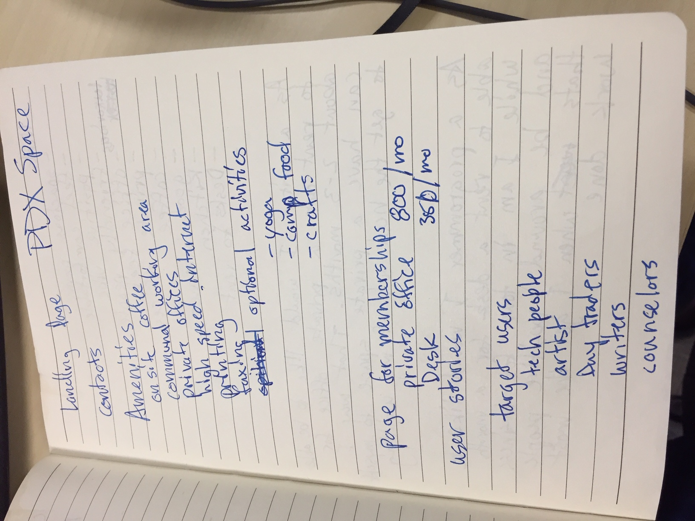
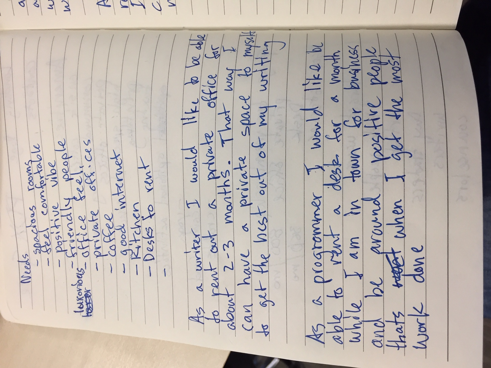
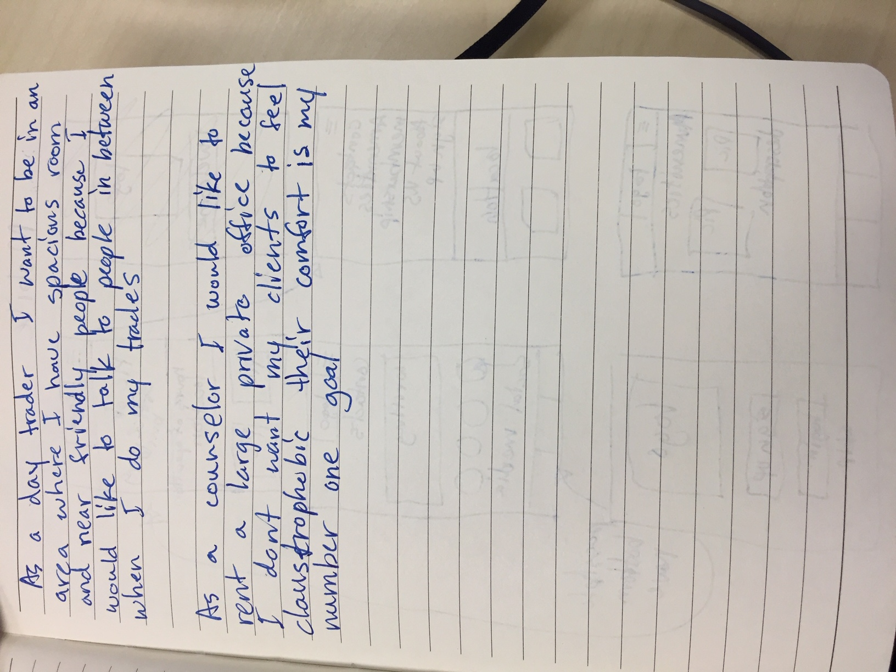
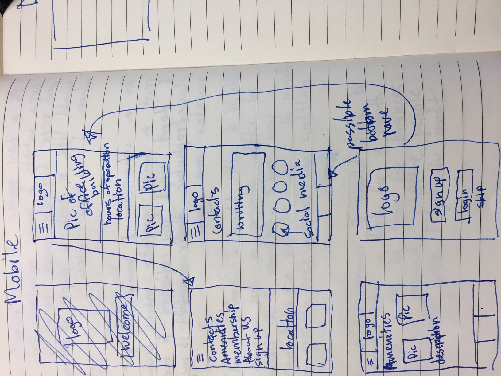

## PDX Space
---

#### Leo Mangutov
#### February 22, 2019

### Description

This project is a website that gives free lance people who want to work in an office environment and have the same productivity as if they were in a real office. We will feature amenities to attach anyone who wants to work on whatever they are working on in a productive environment.
### Images

#### Desktop Version

#### Mobile Version

### User Stories

* As a writer I would like to be able to rent out a private office for about 2-3 months. That way I can have a private space to myself to get the best out of my writing.

* As a programmer I would like to be able to rent a desk for a month while I am in town for business and be around positive people thats when I get the most work done.

* As a day trader I want to be in a area where I have spacious room and near friendly people because I would like to talk to people in between when I do my trades. It makes me feel less lonely.

* As a counselor I would like to rent a large private office because I don't want my clients to feel claustrophobic their comfort is my number 1 goal. When we have this type of setting we can connect more.

* As a project manager when me and my team are in town for business for 2-4 weeks. We would like to rent a private office for 6-8 people and be in a comfortable setting, our process flow goes a lot more smoother when these needs are met.

### Technologies and Resources

* List
* What
* Outside
* Technologies
* You've
* Used
* Here

### Responsiveness

Describe how the site is responsive, and what different 'versions' this project includes (does it have a mobile version? tablet version? )

### Setup Instructions

Describe how someone can clone and launch this project.

### Roadmap

Is there work you plan on continuing doing on this project? Features you'd like to add?

* Consider
* Listing
* Them
* Here

### License

Determine the license under which this application can be used.

Copyright (c) 2018 **_Leo Mangutov_**
