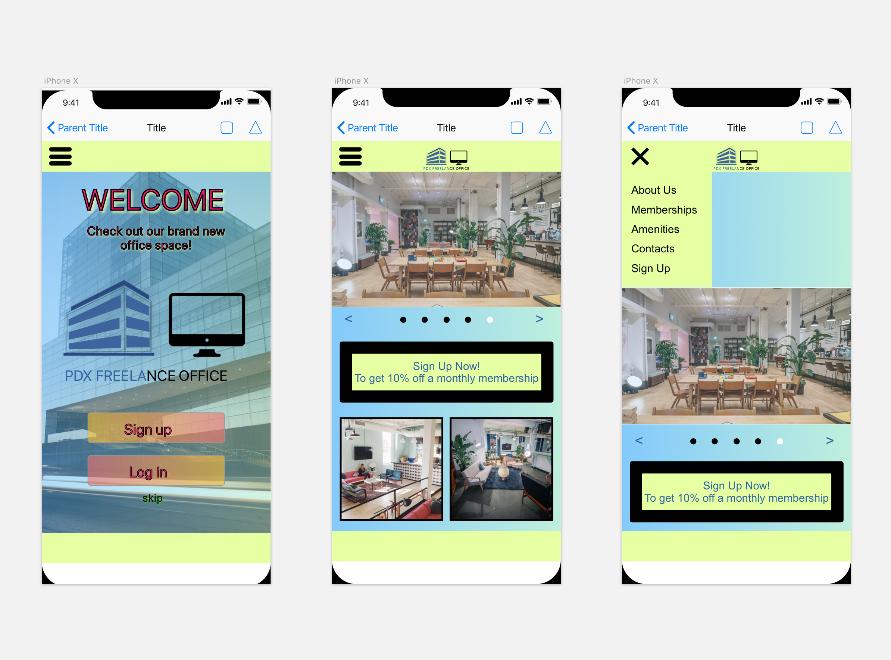
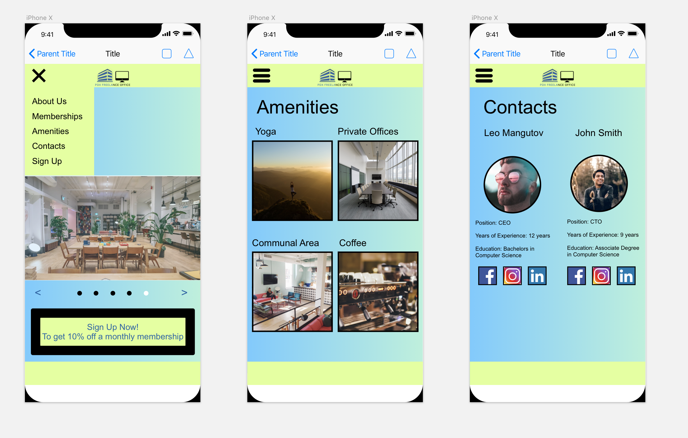

## PDX Space
---

#### Leo Mangutov
#### February 22, 2019

### Description

This project is a website that gives free lance people who want to work in an office environment and have the same productivity as if they were in a real office. We will feature amenities to attach anyone who wants to work on whatever they are working on in a productive environment.
### Images

#### Desktop Version

#### Mobile Version

### User Stories

* As a writer I would like to be able to rent out a private office for about 2-3 months. That way I can have a private space to myself to get the best out of my writing.

* As a programmer I would like to be able to rent a desk for a month while I am in town for business and be around positive people that's when I get the most work done.

* As a day trader I want to be in a area where I have spacious room and near friendly people because I would like to talk to people in between when I do my trades. It makes me feel less lonely.

* As a counselor I would like to rent a large private office because I don't want my clients to feel claustrophobic their comfort is my number 1 goal. When we have this type of setting we can connect more.

* As a project manager when me and my team are in town for business for 2-4 weeks. We would like to rent a private office for 6-8 people and be in a comfortable setting, our process flow goes a lot more smoother when these needs are met.

### Technologies and Resources

* HTML
* CSS
* SASS
* JavaScript
* jQuery
* Webpack
* NPM
* Different loaders

### Responsiveness

This webpage is responsive to the mobiles view, and it will have a mobile version.

### Setup Instructions

* Clone down repository
* Open up terminal
* Find directory where you cloned the file to
* Run in terminal "npm install" to download the dependencies
*

### Roadmap

* Add a navigation bar
* Create the contacts page
* Create the amenities page

### License

Permission is hereby granted, free of charge, to any person obtaining a copy
of this software and associated documentation files (the "Software"), to deal
in the Software without restriction, including without limitation the rights
to use, copy, modify, merge, publish, distribute, sublicense, and/or sell
copies of the Software, and to permit persons to whom the Software is
furnished to do so, subject to the following conditions:

The above copyright notice and this permission notice shall be included in all
copies or substantial portions of the Software.

THE SOFTWARE IS PROVIDED "AS IS", WITHOUT WARRANTY OF ANY KIND, EXPRESS OR
IMPLIED, INCLUDING BUT NOT LIMITED TO THE WARRANTIES OF MERCHANTABILITY,
FITNESS FOR A PARTICULAR PURPOSE AND NONINFRINGEMENT. IN NO EVENT SHALL THE
AUTHORS OR COPYRIGHT HOLDERS BE LIABLE FOR ANY CLAIM, DAMAGES OR OTHER
LIABILITY, WHETHER IN AN ACTION OF CONTRACT, TORT OR OTHERWISE, ARISING FROM,
OUT OF OR IN CONNECTION WITH THE SOFTWARE OR THE USE OR OTHER DEALINGS IN THE
SOFTWARE.

Copyright (c) 2019 **_Leo Mangutov_**
